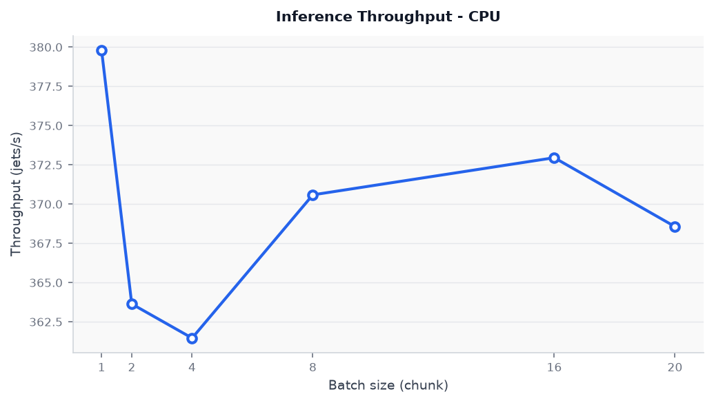

# Jet Tagging GNN

EdgeConv-based Graph Neural Network for top quark jet tagging, served as a REST API.

Made by Rafael Duarte

**Live endpoint:** https://rmduarte-jet-gnn-production.up.railway.app

---

## Model

| Property | Value |
|---|---|
| Architecture | EdgeConv (Dynamic Graph CNN) |
| Dataset | Top Quark Tagging — [Zenodo 10.5281/zenodo.2603256](https://doi.org/10.5281/zenodo.2603256) |
| Input | Up to 200 particles per jet, 4-momentum `(E, PX, PY, PZ)` |
| Graph | k-NN (k=7) in `(Δη, Δφ)` space, built at inference time |
| AUC-ROC | **0.9655** |
| Bkg. rejection @ 30% sig. eff. | **214:1** |
| Bkg. rejection @ 50% sig. eff. | **70:1** |

---

## API

### Endpoints

| Method | Path | Description |
|---|---|---|
| `GET` | `/health` | Liveness check |
| `GET` | `/model` | Registered model metadata |
| `POST` | `/predict/batch` | Batch inference (up to 100 jets) |
| `POST` | `/batch/run` | Throughput benchmark |

### Quick start

```bash
# health check
curl https://rmduarte-jet-gnn-production.up.railway.app/health

# single jet inference
curl -X POST https://rmduarte-jet-gnn-production.up.railway.app/predict/batch \
  -H "Content-Type: application/json" \
  -d '{
    "jets": [[
      [397.2, -120.3,  89.4, 371.5],
      [210.8,   55.1, -180.2, 190.3],
      [ 89.3,   12.4,  -55.7,  75.1]
    ]]
  }'
```

Each particle is `[E, PX, PY, PZ]`. Zero-padded particles (`E=0`) are dropped internally before graph construction.

### Response schema

```json
{
  "results": [
    {
      "score": 0.996,
      "prediction": 1,
      "latency_ms": 9.5
    }
  ],
  "n_jets": 1,
  "throughput_jets_s": 50.3,
  "total_ms": 19.9
}
```

---

## Inference performance

| Environment | p50 latency | Throughput |
|---|---|---|
| Local — Intel i5-11320H, CPU-only | ~9 ms/jet | ~50 jets/s (via API) · ~370 jets/s (direct) |
| Railway free tier — shared 2 vCPU | ~5.5 s/jet | ~0.19 jets/s |

Throughput curve (local, varying batch size):



Peak throughput (~379 jets/s) at batch_size=1; performance is stable across batch sizes (361–379 jets/s range), consistent with sequential k-NN graph construction dominating inference time on CPU.

---

## Stack

- **Model:** PyTorch 2.14 + PyTorch Geometric 2.8
- **Serving:** FastAPI 0.140 + Uvicorn 0.51
- **Persistence:** SQLAlchemy 2.0 + SQLite (ephemeral)
- **Deploy:** Docker (python:3.12-slim) on Railway

---

## Reproducing

```bash
git clone https://github.com/rduarte12/jet_tagging_gnn
cd jet_tagging_gnn
pip install -r requirements.txt --extra-index-url https://download.pytorch.org/whl/cpu
uvicorn src.api:app --reload
```

Benchmark:

```bash
python benchmark.py
```
